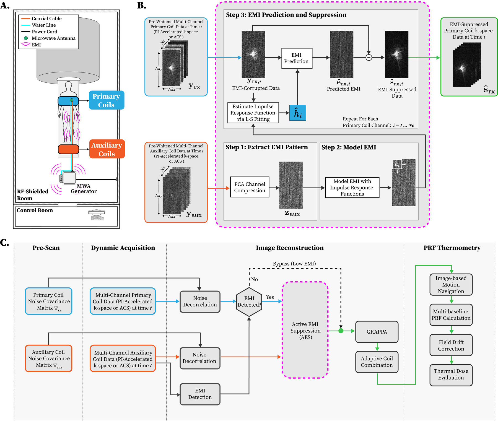

# Active EMI Suppression for MRI-Guided Microwave Ablation

MATLAB code and example datasets accompanying:

> **Active Electromagnetic Interference Suppression for MRI and Proton
> Resonance Frequency Shift Thermometry during MRI-Guided Microwave Ablation.**
> Q. Dai et al. *Magnetic Resonance in Medicine* (2026).
> DOI: [10.1002/mrm.70440](https://doi.org/10.1002/mrm.70440)


## Overview

Active EMI Suppression (AES) uses auxiliary receiver coils to sense electromagnetic
interference (EMI) from the microwave ablation equipment and removes it from the
primary imaging coil k-space, enabling accurate PRF-shift thermometry during MRI-guided
microwave ablation at 3T.



## System Requirements

* MATLAB R2022b or later.

## Usage

Run from the repository root:

1. `demo_gel_experiment.m` — AES on gel phantom data acquired during microwave ablation.
2. `demo_pig_experiment.m` — AES on in vivo pig liver data acquired during microwave ablation.

Each demo loads the corresponding `.mat` from `data/`, runs noise decorrelation →
PCA → AES → GRAPPA → adaptive coil combination, and produces k-space, single-coil,
and coil-combined comparison figures.

## Repository Layout

```
.
├── data/                       Example k-space datasets (.mat)
├── demo_gel_experiment.m       Gel phantom demo
├── demo_pig_experiment.m       In vivo pig liver demo
├── figure_1.png                Pipeline / setup overview
└── src/
    ├── AES/                    Core AES + PCA auxiliary-coil compression
    ├── GRAPPA/                 GRAPPA parallel imaging reconstruction
    ├── coil_combination/       Adaptive coil combination
    └── utils/                  Noise decorrelation, helpers
```

## License

Released under the **UCLA Academic Software License** — free for academic or
nonprofit research use, including modification and redistribution to other
academic/nonprofit researchers (any redistribution must include this same
license). See `LICENSE` for the full terms.

Commercial entities: please contact **Dr. Holden H. Wu**
(holdenwu@mednet.ucla.edu) for licensing opportunities.

## Contact

* Qing Dai — qdai@ucla.edu
* Holden H. Wu — holdenwu@mednet.ucla.edu

## Acknowledgements

1. EDITER by Sai Abitha Srinivas — https://github.com/abithasrinivas/EDITER_LowfieldMRI
2. GRAPPA Reconstruction Tools by Mark Chiew — https://github.com/mchiew/grappa-tools
3. Coil combination and noise decorrelation toolbox by Shu-Fu Shih — https://github.com/HoldenWuLab/LLR-image-denoising
